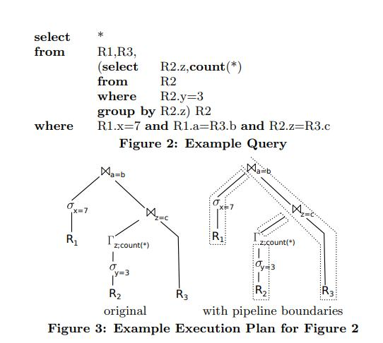
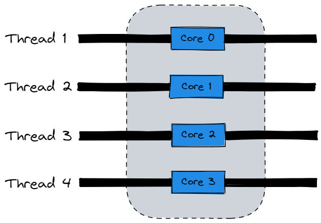
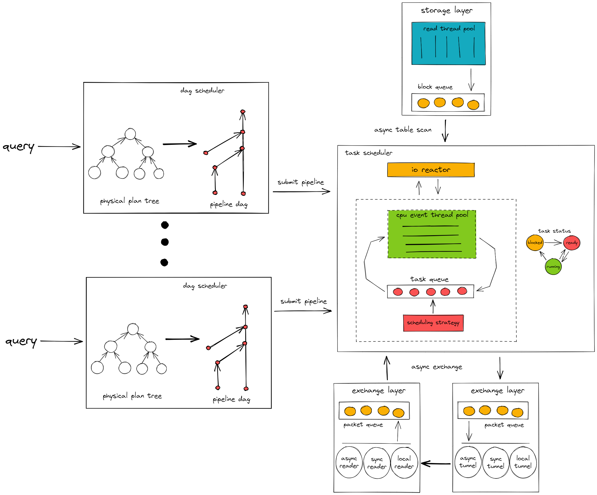
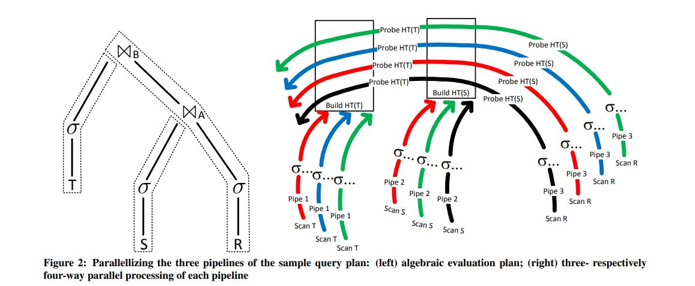
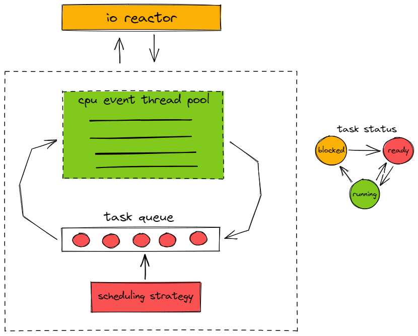
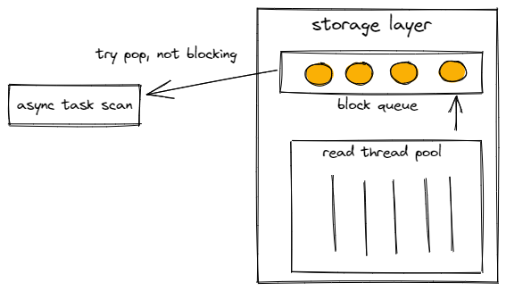
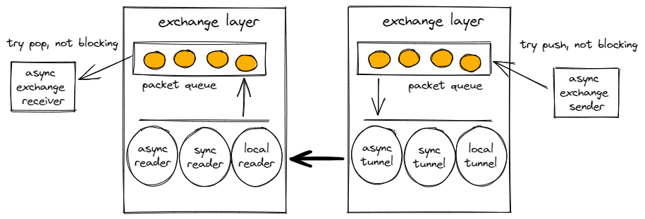
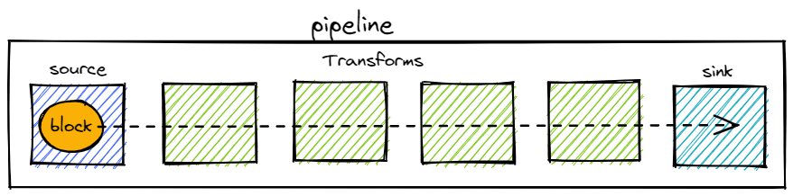

# 团队介绍
爱吃苦瓜和大米
- [SeaRise](https://github.com/SeaRise): TiFlash 研发工程师
# 项目介绍
TiPipeline  
Better TiFlash execution model！  
抛弃 TiFlash 计算层原有的简单粗暴线程模型，基于 hyper morsel driven 的设计，完成新的 TiFlash 计算层执行模型 pipeline model，让 TiFlash 在高并发场景下有很好的执行效率和 query 公平调度。
- 基于 pipeline breaker 的理论，将执行流拆分为计算密集型的若干 pipeline，最大化利用 cpu。
- 使用 thread per core 线程模型，消除 context switch 的开销，以及在此基础上做 query 的公平调度执行。  

最终实现一个公平调度、高性能且在多核机器上具备线性扩展性的执行模型。
# 背景 & 动机
目前 TiFlash 计算层的执行模型对线程的使用是无节制的，一个 query 会申请且占据若干条线程执行，直到 query 结束为止才释放线程。这种线程模型在高并发场景下的表现并不优。TiFlash 5.x 在高并发场景下
- cpu 无法打满，利用率只能维持在 50% 左右
- 容易 OOT (out-of-threads)

在之后为了解决这两个问题 TiFlash 引入了三个设计
- dynamic thread pool
  - cpu 利用率上不去的原因是因为频繁的线程创建销毁导致，可见 [深入解析 TiFlash丨多并发下线程创建、释放的阻塞问题](https://cn.pingcap.com/blog/deep-interpreting-of-tiflash)。这中间涉及到一段很长的锁临界区，导致 cpu 无法打满。
  - dynamic thread pool 在 TiFlash 层做了 thread cache，绕过了线程创建销毁的锁临界区，从而能让 TiFlash cpu 利用率在高并发下打满。
- async grpc
  - 将 TiFlash 中用于 grpc 的线程数控制在接近常数个。尽量不随 query 数的增加而增长。
- minTso scheduler
  - 对输入 query 的排队调度器，控制单个 TiFlash 节点内可用的线程数，让 tso 小的 query 可以占据线程执行，tso 大的  query 等待线程被释放再执行。

在这三个设计 merge 后的 tiflash 6.x 的确可以在高并发下打满 cpu 且不会 OOT。但是这并没有解决以下问题:
- kernel 线程调度的 overheads，kernel 的线程调度机制在计算场景下是很低效的，有大量的 context switch。
- 多 query 间不能公平执行，minTso scheduler 给 query 带来了极大的不公平，早上车的 query 可以使用充足的线程去执行，晚上车的 query 只能干等。

本项目将使用新的执行模型 pipeline model 优化 TiFlash 在高并发场景下的执行效率以及具备 query 间公平调度的能力。
# 项目设计
本项目将演进 TiFlash 的执行模型，实现 pipeline model。
## what is pipeline model
`pipeline model = pipeline + thread per core`  
将发送给 TiFlash 的 operator-dag 解析成 pipeline-dag，并且跑在全局共享的固定大小线程池上。
### what is pipeline
Hyper 的论文阐述了，在算子执行流中，aggregate/join/sort 等等算子里存在 pipeline breaker。在 pipeline breaker 之前的执行流执行完成后，pipeline breaker 之后的执行流才能执行。比如 HashJoin 中 build hash map 的动作就是一个 pipeline breaker。
```
Hyper's papers:
- Efficiently Compiling Efficient Query Plans for Modern Hardware
- Morsel-Driven Parallelism: A NUMA-Aware Query Evaluation Framework for the Many-Core Age
- ...
```
如果把整个算子执行流按 pipeline breaker 切分，就会切分出若干个 pipeline。pipeline 是理论上不存在任何阻塞、停顿的执行概念，也意味着是 cpu 密集型，能最大化利用 cpu。  

### what is thread per core
即固定大小的线程池。  
全局只有 cpu core num 个线程，与 cpu core 一一对应的线程模型。  
能够消除线程调度的 context switch 开销，提高 cpu 有效利用率。  

## design overview
`TiPipeline = pipeline + thread per core + async io interface`  

## pipeline scheduler
pipeline model 的 scheduler 有 dag 和 task 两类。  
pipeline scheduler 会将输入 tiflash 的 oprerator-dag 转换为 pipeline-dag，并按 dag 关系逐一调度 pipeline 执行。  
每个 pipeline 会被实例化成若干个 pipeline-task，pipeline-task 会被扔到固定大小的线程池上执行。  
原则上单个 pipeline 实例化的 task 的数目与线程池大小一致。  

### dag scheduler
在 v6.3 [planner refactor](https://github.com/pingcap/tiflash/blob/7c0472c9acef27d5b48d834fd62589b81446ced8/docs/design/2022-04-24-planner-refactor.md) 完成以后，TiFlash 就具备了构造 pipeline dag 的能力。  
首先使用 planner interpreter 将输入 TiFlash 的 DAGRequest 解释为 PhysicalPlan Tree。在 PhysicalPlan Tree 中找到 pipeline breaker，按 pipeline breaker 切分即可得到 pipeline dag。  
dag scheduler 会按照 pipeline 的 dag 关系，逐一调度 pipeline 提交到 task scheduler 执行。  
每个 MPPTask 都会有自己独立的 dag scheduler。  

### task scheduler
task scheduler 是全局共享的，这就意味着所有 query 的 pipeline 实例化出来的 task 都提交到同一个 task scheduler。  
task scheduler 内部会维护 cpu core num 大小的线程池和一个 task queue。  
pipeline 提交到 task scheduler 后会被实例化成若干个 pipeline task，pipeline task 的数目一般为 cpu core num。  
线程池从 task queue 里获取 ready pipeline task 执行。pipeline task 在被执行一段时间后(上限 100 ms)，就会被放回 task queue 等待下次调度执行。  
可以针对 task queue 做排序策略，让高优先级的 task 先执行，目前默认实现是简单的先进先出，也就等同所有的 task 是同等优先级，也意味着 query 间是公平调度。  
pipeline task 有三种状态:
- ready，在 task queue 里等待调度执行，被线程池调度执行后状态转为 running  
- running，在线程池中被执行  
    - 在执行完分配的时间片后状态转为 ready 放入 task queue  
	- 发现有 io 相关阻塞事件后状态转为 blocked 传给 io reactor  
- blocked，由于 io 相关事件被阻塞，在 io reactor 轮询检查状态 ok 后再转为 ready 放入 task queue.  

  
## async io interface
有 table scan，shuffle 算子的 pipeline 会涉及到 io 相关操作，就意味着 pipeline 会引入阻塞逻辑，这个与 pipeline model 是相违背的，所以需要包装 io 相关的操作，提供 async io interface。
### async table scan
在 v6.3 [TiFlash 存储层独立程池](https://github.com/pingcap/tiflash/blob/7c0472c9acef27d5b48d834fd62589b81446ced8/docs/design/2022-07-25-read-thread-pool-and-data-sharing.md) 引入后，tiflash 的存储层引擎 delte tree engine 的相关读取操作都是在独立的存储层线程池中执行，计算层线程只是在等待存储层线程池完成读取操作将数据块写入队列后，从队列里读取数据块。  
所以这里只需要包装新的 async table scan 接口，让 table scan 不阻塞在存储层队列的 pop 上，而是用 try pop。  
  
### async exchange
tiflash 用于做 shuffle 的算子是 exchange sender 和 exchange receiver，这两个算子会涉及到跨 tiflash 节点的网络通信。  
TiFlash 原先的实现用 packet queue 来做网络层和计算层的交互。计算层线程会 push/pop packet queue，如果 packet queue full/empty，计算层线程就会阻塞。  
这里只需要包装新的 async exchange 接口，使用 try push/try pop，不阻塞在和 packet queue 的交互上。  
  
从上图可看到，async exchange 接口和使用 async 还是 sync grpc 并没有关系，不过出于减少线程数的考量，还是把 async grpc 作为 pipeline model 的前提。  
## push model
因为 async io interface，TiFlash 原先的 pull model 实现 BlockInputStream 在代码逻辑上会别扭一些。  
所以会在 BlockInputStream 的基础上重新拆解包装出代码逻辑上比较合理的 push model 实现。  
  
- source 用于读算子，比如 async exchange receiver，async table scan，语义保证无阻塞  
- sink 用于写算子，比如 async exchange sender，语义保证无阻塞  
- 其余的算子都归类到 transform 里，语义保证无阻塞  
